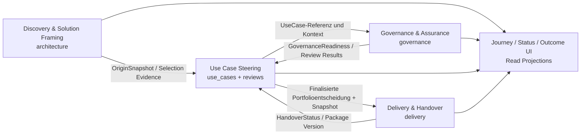

# Domain Context Map – KI-UseCase-Radar

Issue: #419  
Analysierter Stand: `main` @ `f8c639481c90965a571314d87f182ecf8e2e2db6`  
Datum: 2026-09-12

## 1. Ergebnis in einem Satz

Der aktuelle Monolith braucht **keinen neuen Django-App-Split**. Die fachlichen Grenzen sind bereits weitgehend erkennbar; das eigentliche Risiko sind **parallel gehaltene Zustände und mehrfach implementierte Cross-Context-Regeln**. Für #419 ist daher **A – keine Strukturänderung** die richtige unmittelbare Entscheidung. Als gezielte Folgearbeit ist **C – Verantwortungen zwischen bestehenden Apps schärfen** sinnvoll: Governance- und Delivery-Fakten müssen jeweils aus genau einer fachlichen Quelle kommen und der Lifecycle muss diese Quellen konsumieren, statt ihre Regeln erneut nachzubauen.

Nicht empfohlen sind aktuell B als breites internes Repackaging, D als neue Django-App und E als Merge bestehender Apps.

## 2. Bewertungsprinzip

Eine Django-App wird hier **nicht automatisch** als Bounded Context interpretiert. Entscheidend sind:

- eigene Fachsprache,
- eigener persistierter Zustand,
- eigene Invarianten und Entscheidungen,
- eigener Änderungsgrund,
- klarer Source of Truth,
- klar definierte Abhängigkeiten zu anderen Bereichen.

Read Models, Journey-Projektionen, Forms, Views und technische Persistenzmodule sind deshalb nicht automatisch eigene Kontexte.

## 3. Empfohlene fachliche Context Map

Die fachliche Prozesskette enthält bewusst Rückkopplungen: Eine positive Use-Case-Entscheidung ermöglicht Delivery; die verbindliche Delivery-Übergabe ist später Voraussetzung für den Pilotstart. Das ist fachlich kein Fehler. Kritisch wird es erst, wenn beide Seiten intern denselben Zustand oder dieselbe Regel parallel implementieren.

### 3.1 Discovery & Solution Framing

**Physisches Mapping:** vor allem `ki_radar/architecture/`.

**Fachliche Verantwortung:**

- Value Stream und Value-Stream-Phasen,
- Prozessanalyse und Prozessvalidierung,
- Lösungsoptionen und deren Vergleich,
- unveränderliche Lösungsentscheidung,
- Herkunft eines abgeleiteten Use Cases einschließlich Source Snapshot.

**Source of Truth:** `ValueStream`, `ProcessAnalysis`, `ProcessValidation`, `SolutionOption`, `SolutionSelectionDecision`, `UseCaseOrigin` und die in `architecture.provenance` erzeugten Herkunftssnapshots.

`SolutionSelectionDecision` besitzt bereits starke eigene Invarianten: dokumentierte Entscheidungen sind unveränderlich und nicht löschbar. `UseCaseOrigin` referenziert die vorgelagerte Phase, Prozessanalyse und gegebenenfalls Lösungsoption. Diese Semantik ist klar vorgelagert und unterscheidet sich vom späteren Use-Case-Lifecycle.

Der bestehende Ansatz, Herkunftsdaten als Snapshot zu übernehmen und spätere Abweichungen über `use_cases.origin_consistency` zu erkennen, ist fachlich sauber: **Discovery besitzt den Ursprungsbeleg; der Use Case besitzt danach seine aktuelle fachliche Formulierung.** Es soll gerade keine automatische Synchronisation beider Modelle geben.

**Boundary-Smell:** `use_cases.intake_views::_persist_optional_origin()` erzeugt `architecture.models.UseCaseOrigin` direkt über den ORM. Die fachliche Richtung ist richtig, der Schreibzugriff liegt aber technisch auf der Consumer-Seite. Langfristig sollte `architecture` einen kleinen Command wie `create_use_case_origin(...)` besitzen, der die Herkunftsinvarianten kapselt.

### 3.2 Use Case Steering

**Physisches Mapping:** fachlich gemeinsam `ki_radar/use_cases/` und `ki_radar/reviews/`.

Das ist der zentrale Context für die Steuerung eines Use Cases von Intake über Bewertung und Portfolioentscheidung bis Pilot, Betrieb und Abschluss.

**Fachliche Verantwortung:**

- Use-Case-Identität und aktueller fachlicher Inhalt,
- Lifecycle-Phase,
- strukturierte Use-Case-Bewertung,
- Portfolio-/Freigabeentscheidung,
- Pilotstart und Go-live-Entscheidung,
- Wirkungsmessung und Abschluss,
- Lifecycle-Entscheidungsprotokoll.

**Wichtig:** `reviews` ist trotz eigener Django-App **kein eigenständiger fachlicher Review-Context**. `Review` dokumentiert Lifecycle-Kommandos wie `START_PILOT`, `GO_LIVE` oder `END`. Die erlaubten Transitionen und Guards liegen in `use_cases.transition_policy`; `reviews.services.create_review()` ist der kanonische atomare Schreibpfad, der Entscheidungsartefakt und `UseCase.status` zusammen persistiert. Fachlich gehören beide Module daher zum selben Bounded Context.

### 3.3 Governance & Assurance

**Physisches Mapping:** `ki_radar/governance/`.

**Fachliche Verantwortung:**

- Governance-Screening,
- Ableitung erforderlicher Fachprüfungen,
- formale Datenschutz-, Informationssicherheits- und Rechtsprüfung,
- Prüfergebnis, Auflagen, Risiken, Maßnahmen und Nachweise.

**Source of Truth:** `GovernanceAssessment` für das Screening und `GovernanceReview` für die formalen Prüfartefakte.

Dieser Bereich hat eigene Sprache, eigene Zustände (`OPEN`, `COMPLETED`, `NOT_RELEVANT`), eigene Ergebnisse (`PASSED`, `PASSED_WITH_CONDITIONS`, `FAILED`) und eigene Modellinvarianten. Er rechtfertigt deshalb eine echte fachliche Grenze.

Die Dateien `use_cases/governance_status.py` und `use_cases/governance_journey.py` sind **kein Gegenargument**. Sie besitzen keinen Governance-Zustand, sondern projizieren Governance-Fakten in die übergreifende Use-Case-Journey. Als Consumer-/Read-Model-Logik dürfen sie im Use-Case-Bereich bleiben.

### 3.4 Delivery & Handover

**Physisches Mapping:** `ki_radar/delivery/`.

**Fachliche Verantwortung:**

- versioniertes Delivery Package,
- Delivery-Sektionen und fachliche/technische Bestätigungen,
- Readiness des Packages,
- Quellenmanifest und Source-Drift,
- verbindliche Übergabe,
- unveränderliche übergebene Package-Versionen.

**Source of Truth:** `DeliveryPackage`, `DeliverySectionReview`, `DeliveryRoleSourceDecision` sowie die Readiness-Services im Delivery-Modul.

Delivery konsumiert eine finalisierte positive Use-Case-Entscheidung und übernimmt Daten bewusst als Snapshot/Arbeitsgrundlage. Nach der Übergabe ist das Package unveränderlich. Diese eigene Versionierungs- und Übergabesemantik begründet einen separaten Context.

### 3.5 Keine eigenen Bounded Contexts

Die folgenden Bereiche sind fachlich wichtig, besitzen derzeit aber keinen ausreichend unabhängigen Source of Truth für einen eigenen Context:

- **Journey / Workflow / Status Dimensions:** Read Models und Navigation über mehrere Kontexte.
- **Outcome Workspace:** Projektion aus Lifecycle, Review-Artefakten, Delivery-Handover und Messdaten; die Messdaten selbst liegen auf dem Use Case.
- **Scale Readiness:** abgeleitete Entscheidungs-/Readiness-Policy aus Pilot-, Governance-, Delivery-, Betriebs- und ML-Test-Score-Evidenz. Der historische Snapshot wird im Lifecycle-Review gespeichert, die Quelldaten bleiben bei ihren jeweiligen Ownern.
- **Decisioning:** aktuell eine interne Capability von Use Case Steering. `DecisionAssessment` und `ApprovalDecision` sind eng an den Use-Case-Lifecycle gekoppelt und brauchen heute keinen eigenen Django-/Bounded-Context-Split.

## 4. Ubiquitous Language

| Begriff | Empfohlene Bedeutung | Abgrenzung |
|---|---|---|
| **Use Case** | steuerbares Vorhaben mit Problem, Verantwortungen, Nutzenhypothese und Lifecycle | nicht mit Lösungsoption oder Delivery Package gleichsetzen |
| **Lifecycle-Phase** | `IDEA`, `REVIEW`, `PILOT`, `OPERATION`, `ENDED` | nicht „Decision Status“ und nicht Journey-Schritt |
| **Use-Case-Bewertung / Assessment** | versionierte Bewertung von Business Value, Fit, Machbarkeit, Datenreife, Risiko und Evidenz | `DecisionAssessment`; nicht Governance-Screening |
| **Portfolioentscheidung** | verbindliche Entscheidung über Weiterverfolgung/Freigabe eines Use Cases | `ApprovalDecision`; „Freigabe“ nur für positive Ergebnisse verwenden |
| **Freigabe** | positives Ergebnis `APPROVED` oder `APPROVED_WITH_CONDITIONS` | nicht als Sammelbegriff für `DEFERRED`/`NOT_PURSUED` verwenden |
| **Governance-Screening** | risikobasierte Vorprüfung, welche Fachprüfungen nötig sind | `GovernanceAssessment`; kein Use-Case-Assessment |
| **Governance-Fachprüfung** | formale Datenschutz-/Security-/Rechtsprüfung | `GovernanceReview`; nicht Lifecycle Review |
| **Lifecycle Review / Lifecycle-Entscheidungsprotokoll** | dokumentiertes Lifecycle-Kommando mit vorherigem/neuem Status und Evidenzsnapshot | heutiges `reviews.Review`; fachlich kein Governance Review |
| **Readiness** | abgeleitete Aussage, ob eine konkrete Aktion verantwortbar/vorbereitet ist | kein eigener Lifecycle-Status |
| **Scale Readiness** | abgeleitete Readiness für Produktivsetzung/Skalierung | kein eigener persistenter Master-State; Snapshot nur als Entscheidungsbeleg |
| **Delivery Package** | versionierte Übergabegrundlage für Umsetzung/Betrieb | nicht der Use Case selbst |
| **Handover / Übergabe** | verbindlicher Abschluss einer Delivery-Package-Version | Source of Truth liegt in Delivery |
| **Wirkungsmessung** | gemessener Ist-Wert plus Messzeitraum/-datum/-nachweis gegenüber der definierten Zielmetrik | Source of Truth liegt aktuell auf `UseCase` |
| **Herkunft / Origin** | unveränderlicher Beleg, aus welcher Discovery-/Lösungsentscheidung ein Use Case entstand | darf vom später veränderten Use Case abweichen |

### Problematischer Begriff: `Review`

`Review` ist aktuell dreifach belastet: Lifecycle Review, Governance Review und allgemeine UI-/Readiness-Prüfung. Im fachlichen Sprachgebrauch sollte deshalb **immer qualifiziert** werden. Ein unqualifiziertes „Review“ sollte in neuen Domain-APIs vermieden werden.

### Problematischer Begriff: `status`

Auch `status` muss qualifiziert werden: Lifecycle-Status, Decision/Portfolio-Status, Governance-Review-Status, Delivery-Package-Status oder Readiness-State. Diese Achsen sind bewusst unabhängig.

`UseCase.decision_status` ist technisch besonders auffällig, weil das Feld sowohl Vorentscheidungszustände (`CLARIFICATION`, `READY`) als auch finale Ergebnisse (`APPROVED`, `DEFERRED`, ...) enthält. Es sollte deshalb als **aktuelle Decision-Projektion** behandelt werden, nicht als alleiniger Beleg einer finalen Entscheidung.

## 5. Ownership und Source of Truth

| Fachliches Konzept | Owner | Kanonischer Source of Truth | Wer darf schreiben? | Aktuelle Auffälligkeit |
|---|---|---|---|---|
| Use-Case-Lifecycle | Use Case Steering | `UseCase.status` | ausschließlich kanonischer Lifecycle-Command über `reviews.services.create_review()` | Regeln liegen korrekt in `use_cases.transition_policy`; Model selbst verhindert Direktwrites nicht |
| Lifecycle-Entscheidungsbeleg | Use Case Steering | `reviews.Review` | `reviews.services.create_review()` | fachlich gleiche Boundary wie Use Case, trotz eigener App |
| Use-Case-Bewertung | Use Case Steering | neueste `DecisionAssessment`-Version | `use_cases.services.create_decision_assessment()` | vier Assessment-Werte werden zusätzlich auf `UseCase` gespiegelt |
| finale Portfolioentscheidung | Use Case Steering | finalisierte `ApprovalDecision` | `submit_approval_decision()` / `confirm_conditional_decision()` | `UseCase.decision_status` ist zusätzliche aktuelle Projektion |
| Governance-Screening | Governance | neueste `GovernanceAssessment` | Governance-Command/View | Required-Flags werden zusätzlich auf `UseCase` kopiert |
| Governance-Fachprüfung | Governance | `GovernanceReview` je Screening/Typ | Governance-Service/View | Completion-Flags werden zusätzlich auf `UseCase` kopiert |
| Delivery-Handover | Delivery | aktuelle `DeliveryPackage`-Version + Delivery-Readiness/Handover-Semantik | Delivery-Services | `use_cases.transition_policy` besitzt eine zweite vereinfachte Implementierung von `current_handed_over_package()` |
| Scale Readiness aktuell | Use Case Steering als Entscheidungs-Policy | Ergebnis von `evaluate_scale_readiness()` aus fremden Owner-Fakten | keine eigene Master-Persistenz; Lifecycle Review speichert Snapshot | dieselben Governance-/Delivery-Fakten werden teilweise erneut rekonstruiert |
| historische Scale-Evidenz | Use Case Steering | `Review.scale_readiness_snapshot` | `reviews.services.create_review()` | Snapshot ist Beleg, nicht aktueller Master-State |
| Wirkungsmessung | Use Case Steering | Metric-Felder auf `UseCase` | Use-Case-Edit/Commands | Outcome Workspace ist nur Projektion |
| Discovery-Herkunft | Discovery & Solution Framing | `UseCaseOrigin.source_snapshot` + immutable Auswahl-/Diagnosebelege | sollte über Architecture-owned Command geschrieben werden | Intake erzeugt `UseCaseOrigin` derzeit direkt |

## 6. Kanonische Invarianten

### 6.1 Lifecycle

Owner: **Use Case Steering**.

Die erlaubten Übergänge werden in `use_cases.transition_policy.COMMAND_RULES` definiert:

- `IDEA -> REVIEW` über `start_review`,
- `REVIEW -> PILOT` über `start_pilot`,
- `PILOT -> OPERATION` über `go_live`,
- `PILOT/OPERATION -> ENDED` über `end`,
- `continue`, `pause`, `rework` verändern die Lifecycle-Phase nicht.

`reviews.services.create_review()` ist der richtige kanonische Schreibpfad, weil Review-Artefakt und aktueller Lifecycle-State in derselben Transaktion gespeichert werden. `use_cases.services.apply_status_transition()` ist sinnvollerweise als Bypass gesperrt.

**Leck:** Nicht alle fachlichen Guards liegen heute auf diesem kanonischen Servicepfad. Das vollständige Scale-Readiness-Ergebnis wird bei `GO_LIVE` in `ReviewForm.clean()` als Blocker erzwungen; `create_review()` berechnet Scale Readiness für den Snapshot, blockiert aber nur die Teilmenge, die `transition_policy.validate_go_live()` separat prüft. Ebenso verlangt das Form bei `END` mindestens `ending_reason` und `data_and_access_handling`, während der Servicepfad diese Pflicht nicht selbst erzwingt. Eine Domain-Invariante darf nicht nur durch ein Form geschützt werden.

### 6.2 Assessment und Portfolioentscheidung

Owner: **Use Case Steering**.

Kanonische Regeln:

- Assessment darf nur in `REVIEW` angelegt werden.
- `NOT_PURSUED` ist für ein neues Assessment terminal; ein neuer Anlauf ist ein neuer Use Case.
- Assessment-Versionen werden fortgeschrieben, nicht überschrieben.
- Evidenzqualität oberhalb einer unbestätigten Annahme benötigt einen Nachweislink (`DecisionAssessment.clean`).
- Positive Portfolioentscheidung benötigt eine aktuelle strukturierte Bewertung.
- Bewertende und entscheidende Person müssen für positive Entscheidungen getrennt sein.
- Business Owner und freigebende Person müssen für positive Entscheidungen getrennt sein.
- Freigabe mit Auflagen braucht definierte Auflage/Verantwortung sowie unabhängige Zweitprüfung.
- Eine abweichende Entscheidung gegenüber der Assessment-Empfehlung ist erlaubt, bleibt aber als Warning sichtbar.

Die `DecisionAssessment`-Instanz ist die fachliche Quelle der versionierten Bewertung. Die Felder `business_value`, `technical_feasibility`, `data_readiness` und `risk_complexity` auf `UseCase` sind heute eine gespiegelt aktuelle Kurzsicht. Diese Spiegelung sollte nicht als zweite Wahrheit verwendet werden.

Für finale Entscheidungen ist eine finalisierte `ApprovalDecision` der Beleg. `UseCase.decision_status` ist eine operative Projektion und reicht alleine nicht aus, um eine finale Freigabe nachzuweisen. Delivery macht dies heute bereits defensiv, indem zusätzlich nach einer finalisierten positiven `ApprovalDecision` gesucht wird.

### 6.3 Governance

Owner: **Governance & Assurance**.

Kanonische Regeln liegen in `governance.models` und `governance.services`:

- Screening und Fachprüfartefakt müssen zum selben Use Case gehören.
- ein offenes Review besitzt noch kein Ergebnis,
- ein laut Screening erforderlicher Review-Typ kann nicht als `NOT_RELEVANT` dokumentiert werden,
- ein abgeschlossenes Review benötigt ein Ergebnis,
- `PASSED_WITH_CONDITIONS` benötigt dokumentierte Auflagen,
- Screening erzeugt pro Review-Typ ein explizites Statusartefakt.

**Größter Ownership-Smell:** `governance.views` schreibt die aus dem Screening abgeleiteten `*_review_required`-Flags auf `UseCase`; `governance.services.sync_completion_from_review()` schreibt `*_review_completed` zurück. Zusätzlich setzt ein Governance-Screening `DecisionAssessment.governance_precheck_completed=True`. Damit schreibt Governance direkt in den Zustand des Use-Case-Contexts.

Parallel dazu rekonstruieren `use_cases.transition_policy`, `use_cases.governance_journey`, `use_cases.governance_status` und `use_cases.scale_readiness` die Governance-Typen bzw. Required-/Completed-Semantik teilweise erneut. Die Suche nach `privacy_review_required`/`privacy_review_completed` zeigt diese Regelduplikation deutlich.

**Soll:** Governance veröffentlicht eine read-only fachliche Sicht, z. B. `GovernanceReadiness`, mit Screening-Existenz, erforderlichen Review-Typen, aktuellem Review-Status/-Ergebnis, Blockern und Auflagen. Use Case Steering und Scale Readiness konsumieren diese Sicht. Die UseCase-Flags können zunächst als Legacy-/Kompatibilitätsprojektion bestehen bleiben, dürfen aber nicht länger als unabhängiger Source of Truth gelten.

### 6.4 Delivery und Handover

Owner: **Delivery & Handover**.

Kanonische Regeln:

- Package entsteht erst auf Basis einer finalisierten positiven Portfolioentscheidung,
- Package-Versionen sind je Use Case eindeutig versioniert,
- `HANDED_OVER` ist unveränderlich,
- Readiness und erforderliche fachliche/technische Bestätigungen gehören zu Delivery,
- Handover-Status und Source-Drift gehören zu Delivery.

**Konkrete Duplikation:** `delivery.services.current_handed_over_package()` bewertet das aktuelle Package über die Delivery-eigene Status-/Readiness-Sicht. `use_cases.transition_policy.current_handed_over_package()` implementiert denselben Begriff noch einmal direkt über Package-Status und Timestamp. Lifecycle und Scale Readiness können dadurch langfristig unterschiedliche Antworten erhalten.

**Soll:** Nur Delivery beantwortet „Ist die aktuelle Package-Version verbindlich übergeben?“. Der Lifecycle konsumiert diese veröffentlichte Query und kennt keine `DeliveryPackage`-Detailregeln.

### 6.5 Scale Readiness

Owner: **Use Case Steering als Go-live-/Skalierungs-Policy**, nicht eigener Bounded Context.

Scale Readiness kombiniert bewusst Fakten aus mehreren Ownern:

- Pilotwirkung und Metric Result aus Use Case Steering,
- Governance-Fakten aus Governance,
- Handover aus Delivery,
- ML-Test-Score- und Betriebsnachweise aus der konkreten Lifecycle-Entscheidung.

Das Ergebnis `ready / conditional / not_ready` ist abgeleitet. Der Snapshot im `Review` ist ein historischer Entscheidungsbeleg.

Scale Readiness sollte deshalb **keine fremden Statusmodelle nachbauen**. Sie soll öffentliche Fakten/Readiness-Resultate der Owner konsumieren. Außerdem muss festgelegt sein, ob ein `blocker` tatsächlich Domain-Enforcement oder nur Advisory ist. Wenn `blocker` Domain-Enforcement bedeutet, muss `reviews.services.create_review()` das vollständige Ergebnis erzwingen und nicht nur das Django-Form.

## 7. Abhängigkeitsrichtung

### Discovery -> Use Case Steering

Discovery ist upstream für Herkunft und Lösungsentscheidung. Use Case Steering übernimmt einen Snapshot und entwickelt danach seinen eigenen fachlichen Zustand weiter. Keine automatische Rücksynchronisation.

Aktuelle Korrekturidee: Der Intake darf die Erstellung anstoßen, sollte aber einen Architecture-owned Origin-Command aufrufen statt `UseCaseOrigin.objects.create()` selbst auszuführen.

### Use Case Steering <-> Governance

Use Case Steering stellt Identität und fachlichen Kontext bereit. Governance führt seine eigene Prüfung durch und veröffentlicht das Ergebnis zurück. **Governance darf keine Lifecycle-/Portfolioentscheidung treffen; Use Case Steering darf keine Governance-Prüfung simulieren.**

Der Informationsfluss ist fachlich beidseitig, die Ownership bleibt trotzdem eindeutig.

### Use Case Steering <-> Delivery

Eine finalisierte positive Portfolioentscheidung ist Eingang für Delivery. Später ist das Delivery-Handover eine Voraussetzung für `START_PILOT`.

Auch hier ist die Prozessabhängigkeit beidseitig, aber die Begriffe sind getrennt:

- Use Case Steering entscheidet „darf/soll umgesetzt bzw. pilotiert werden?“,
- Delivery entscheidet „ist dieses konkrete Package bereit und verbindlich übergeben?“,
- Lifecycle entscheidet unter Nutzung des Delivery-Fakts „darf der Pilot jetzt starten?“.

### Projektionen

`workflow.py`, `journey.py`, `governance_journey.py`, `governance_status.py`, `status_dimensions.py` und `outcome_workspace.py` dürfen mehrere Kontexte lesen. Sie sind **nicht** der Ort für neue Source-of-Truth-Regeln oder Cross-Context-Schreiblogik.

## 8. Aktuelle Boundary Violations und Risiken

| Priorität | Befund | Risiko | Zielrichtung |
|---|---|---|---|
| **P1** | Governance-Required-/Completed-State gleichzeitig in Governance-Artefakten und auf `UseCase` | Divergenz; mehrere Stellen müssen synchron bleiben | Governance als Master, UseCase-Spiegel nur Legacy/Projection |
| **P1** | Governance-Review-Typen und Statusauswertung mehrfach in `governance.services`, `use_cases.transition_policy`, `governance_journey`, `governance_status`, `scale_readiness` beschrieben | fachliche Regeln driften auseinander | eine veröffentlichte Governance-Readiness-Sicht |
| **P1** | `current_handed_over_package()` in Use Case und Delivery separat implementiert | unterschiedliche Handover-Wahrheiten möglich | Delivery-Query ist allein kanonisch |
| **P1** | vollständige Scale-Readiness-Blocker und END-Pflichtfelder teilweise nur im Form | direkter Service-Aufruf kann fachliche UI-Gates umgehen | Guard in kanonischen Lifecycle-Service/Policy verschieben |
| **P2** | `DecisionAssessment`-Scores werden auf `UseCase` gespiegelt | unklarer Source of Truth bei späteren Änderungen | Assessment als Master; Mirror explizit als Projection/deprecate |
| **P2** | `UseCase.decision_status` mischt Readiness (`READY`) und finale Ergebnisse und spiegelt finalisierte `ApprovalDecision` | Konsumenten könnten Projektion mit Entscheidungsbeleg verwechseln | finale Entscheidung immer über `ApprovalDecision`; Feld später semantisch trennen/vereinfachen |
| **P2** | Use-Case-Intake schreibt `UseCaseOrigin` direkt in `architecture` | Consumer kennt Persistenzdetails des Upstream-Contexts | Architecture-owned Command/API |
| **P3** | `reviews` als App-Name und `Review` als Modellname sind fachlich mehrdeutig | erschwert Ubiquitous Language | fachlich als Lifecycle Review dokumentieren; kein Rename ohne Nutzenbeleg |
| **P3** | `UseCasesConfig.ready()` baut Journey-Verhalten über mehrere `install()`-/Monkey-Patch-Schichten zusammen | versteckte technische Komposition, erschwerte Navigation | erst nach Ownership-Fixes intern vereinfachen; kein DDD-Split-Grund allein |

## 9. Alternativen

### Alternative 1: Neue Django-App `lifecycle` oder `decisioning`

**Nicht empfohlen.**

Lifecycle, Assessment, Portfolioentscheidung, Outcome und Review-Artefakt teilen heute denselben Use-Case-Aggregatbezug und dieselben Transaktionen. Ein physischer Split würde Migrationen, Imports und zusätzliche APIs erzeugen, ohne aktuell eine unabhängige Ownership oder ein eigenes Team-/Release-Modell abzubilden.

### Alternative 2: Alle `governance_*`-Dateien aus `use_cases` nach `governance` verschieben

**Nicht empfohlen.**

`governance_status.py` und `governance_journey.py` sind Consumer-Projektionen der übergreifenden Use-Case-Journey. Der Dateiname enthält Governance, aber die Verantwortung ist Journey-/UI-Projektion. Ein Move würde die fachliche Ownership eher verschleiern.

### Alternative 3: Governance in `use_cases` zurückmergen

**Nicht empfohlen.**

Governance besitzt eigene Modelle, Status, Prüfergebnisse, Fachrollen und Invarianten. Gerade diese Semantik soll vom Portfolio-/Lifecycle-Entscheid getrennt bleiben.

### Alternative 4: `reviews` in `use_cases` mergen

**Derzeit nicht nötig.**

Fachlich sind beide bereits ein Context. Die getrennte Django-App kann als technisches Modul für Audit-/Lifecycle-Entscheidungsartefakte bestehen bleiben. Ein physischer Merge liefert aktuell wenig Nutzen und verursacht Migrations-/Importkosten.

### Alternative 5: Gezielte Ownership-Korrektur zwischen bestehenden Apps

**Empfohlen als Folgearbeit.**

Keine neuen Apps. Stattdessen:

1. Governance veröffentlicht eine kanonische Readiness-/Status-Query; fremde Module rekonstruieren Governance-Regeln nicht mehr.
2. Delivery veröffentlicht kanonisch den aktuellen Handover-Status; `use_cases` entfernt die eigene Handover-Implementierung.
3. Lifecycle-Service erzwingt seine Domain-Invarianten serverseitig; Forms bleiben UX-Validierung.
4. Architecture kapselt die Erzeugung von `UseCaseOrigin` hinter einem eigenen Command.

## 10. Strukturentscheidung für #419

### Entscheidung: **A jetzt, C als gezielte Folgearbeit**

**A – keine Strukturänderung im Rahmen von #419:** Die vorhandenen App-Grenzen liefern bereits genügend fachliche Trennung. Es gibt keinen belastbaren Grund für neue Apps, App-Merges oder einen großen Paketumbau.

**C – Verantwortungen zwischen bestehenden Apps schärfen:** Die Analyse zeigt konkrete Ownership-Leaks, die ein Folge-Refactoring rechtfertigen. Dabei müssen nicht zwingend Dateien verschoben werden. Entscheidend ist, dass Domain-Fakten nur von ihrem Owner berechnet und geschrieben werden.

B, D und E werden zum analysierten Stand nicht empfohlen.

## 11. Kleinster sinnvoller nächster Schritt

Ein separates Folge-Issue ist gerechtfertigt. Der erste Schritt sollte **nicht** „Ordner verschieben“ heißen, sondern die zwei wichtigsten öffentlichen Fachverträge festziehen:

> **[Refactor] Kanonische Governance- und Delivery-Readiness für Lifecycle konsumieren**

Minimaler Scope:

- eine Governance-owned Query/Result-Struktur für Screening + erforderliche Reviews + aktuelle Ergebnisse/Blocker,
- `use_cases.transition_policy`, `governance_journey`, `governance_status` und `scale_readiness` konsumieren diese Sicht statt eigener Required-/Completed-Regeln,
- `use_cases.transition_policy` entfernt die eigene Handover-Ermittlung und nutzt die Delivery-owned Query,
- keine Änderung der Nutzerführung und keine neue Django-App.

Separat davon sollte ein Guard-Fix sicherstellen, dass vollständige Scale-Readiness-Blocker und Closure-Pflichtfelder im kanonischen `reviews.services.create_review()`-/Transition-Policy-Pfad liegen. Das ist eher Korrektheit als Struktur und sollte nicht mit einem großen DDD-Umbau vermischt werden.

## 12. Abschlussbewertung

DDD zeigt hier **keinen Bedarf für einen großen Architekturumbau**, sondern macht zwei Dinge sichtbar:

1. Die fachlichen Kernkontexte sind bereits vorhanden: Discovery, Use Case Steering, Governance und Delivery.
2. Die gefährlichen Stellen liegen an den Grenzen: gespiegelt persistierte Governance-Zustände, doppelte Handover-/Governance-Auswertung und Domain-Guards, die teilweise nur in Forms leben.

Der nachhaltigste Weg ist deshalb: **bestehende Grenzen behalten, Source of Truth explizit machen, Cross-Context-Schreibzugriffe reduzieren und Owner-Fakten über kleine read-only Domain-Resultate konsumieren.** Erst wenn danach innerhalb von `use_cases` weiterhin unterschiedliche Änderungsgründe unabhängig wachsen, wäre ein zusätzlicher interner Split fachlich begründet.
